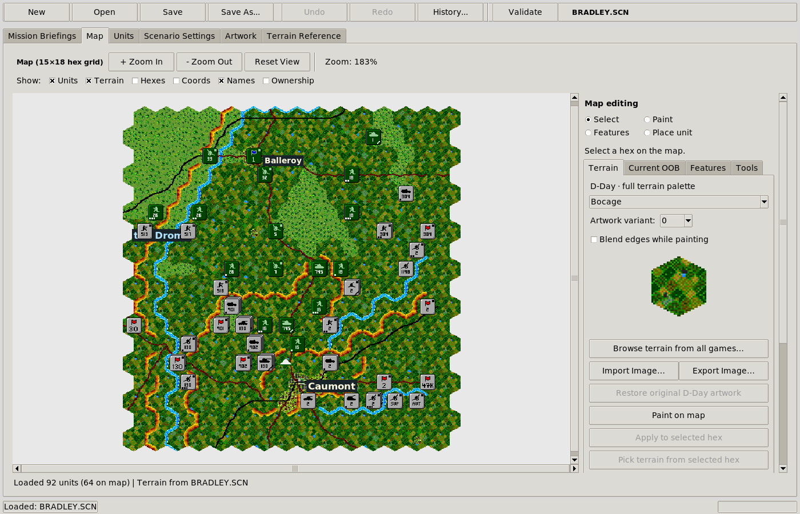
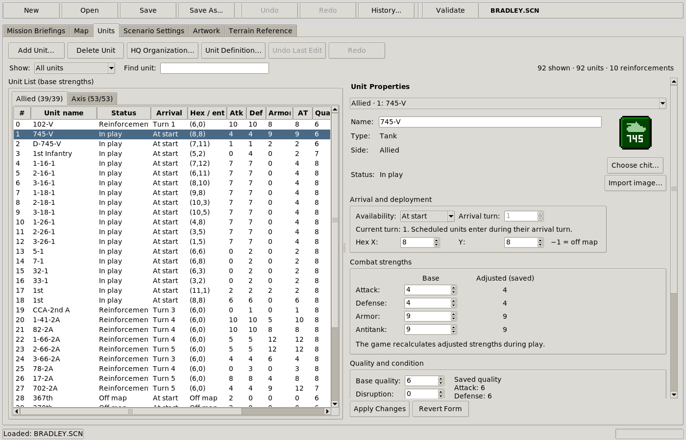
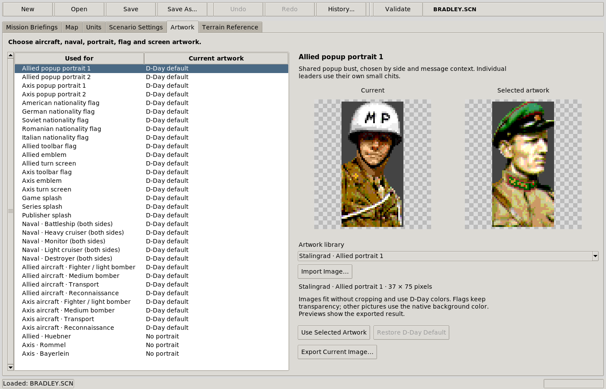

# Atomic Editor

A desktop scenario editor, conversion toolkit, and set of DOS engine patches for
Atomic Games’ **World at War** and **V for Victory** games. Edit an existing
battle or build one from scratch, then play it in a single patched copy of
**World at War: D-Day — America Invades!**

The editor runs in Python with Tkinter. The game still runs in DOS; development
and runtime checks use DOSBox-X.



*Bradley’s Nightmare on the Map page. Terrain, roads, rivers, place names, and
unit counters use the game’s artwork.*

## What the editor can do

- **Create, edit, and save scenarios.** New maps from 4×4 to 125×125 hexes,
  start dates from 1939–1945, and scenarios up to 400 turns. Save, Save As,
  undo/redo, edit history, validation, and unsaved-change tracking are included.
- **Build maps.** Paint terrain and artwork variants; add roads, railways,
  rivers, streams, slopes, and hilltops. Edit place names and territorial
  ownership, blend cosmetic terrain edges manually or automatically, resize or
  shift maps, flood fill, and copy regions with units, objectives, and labels.
  Toggle units, terrain, hex outlines, coordinates, names, and ownership.
- **Edit the order of battle.** Add, delete, restore, and place units; edit
  names, combat stats, quality, condition, nationality, movement, and stacking.
  Manage HQ organization, reinforcement dates and entry hexes, and aircraft or
  naval roster categories. Move whole formations together.
- **Configure logistics and orders.** Edit carried supply, HQ reserves and
  distribution limits, mounted infantry/armor relationships, and saved movement
  routes. Set secondary orders such as Dig In, Fortify, and Replace, plus
  artillery preparation, targeting, counterbattery, and related missions.
- **Author scenario data.** Edit both sides’ briefings, objectives and casualty
  scoring, leaders, replacements, garrisons, supply groups, depots, historical
  weather sequences, and initial snow, ice, and wetness.
- **Script battle plans and events.** Issue timed HQ orders or trigger them
  from objective control and losses. Combine nested ALL/ANY conditions, retain
  activated orders, release reinforcements, and show one-time public messages.
- **Reuse or import artwork.** Browse terrain and unit libraries from all the
  supported games. The extracted unit library contains 15,401 templates from
  50 scenarios. Import custom terrain, ground-unit chits, leader portraits,
  shared popup busts, flags, support-category images, and startup splash screens.
- **Choose scenario rules.** Game profiles expose victory ratios, adapted
  winter models, and verified terrain movement and combat constants. Export
  carries those settings into the patched game.

<details>
<summary>More screenshots: units and artwork</summary>



*Units and reinforcements share one roster, with editable properties and a chit preview.*



*The Artwork page previews library images or custom imports before applying them.*

</details>

See the [editor guide](txt/SCENARIO_EDITOR_README.md) for the individual controls
and their limits.

## Games and scenarios

The scenario library covers **50 battles: seven native D-Day scenarios and
43 converted scenarios** from the earlier games.

| Game / battleset | Scenarios | Examples |
| --- | ---: | --- |
| World at War: D-Day — America Invades! | 7 native | Bradley’s Nightmare, SS Counterattack, Operation Cobra, Omaha Beach |
| World at War: Stalingrad | 10 converted | Operation Uranus, Rattenkrieg, Wintergewitter |
| World at War: Operation Crusader | 6 converted | Operation Crusader, Hell Fire Pass, Fortress Tobruk |
| V for Victory: Utah Beach | 6 converted | Objective Carentan, Race for Carteret, Final Assault |
| V for Victory: Velikiye Luki | 7 converted | Fortress in the Snow, Into the City, Red Storm |
| V for Victory: Market Garden | 7 converted | A Bridge Too Far, Screaming Eagles, Hell’s Highway |
| V for Victory: Gold–Juno–Sword | 7 converted | Off the Beaches, To Caen!, Attack of the 12th SS |

The other native D-Day scenarios are **St Lo**, **Utah Beach**, and
**America Invades!** Earlier-game SCNs can be opened directly in the editor;
conversion creates an unsaved D-Day document, leaving the source intact.

All 43 conversions have been prepared as DOS SCN/REZ/AI sets in the development
workspace. Generated scenario folders are excluded from Git, so a source checkout
may need to generate them from the original game files. The converter can produce
a flat collection ready to copy into a patched game:

```sh
python3 scenario_converter.py game --dos -d my-export/SCENARIO
```

Existing outputs are never overwritten. For an editing document instead, open
the original SCN in the editor or omit `--dos` when using the converter.

**Conversions are adaptations to D-Day’s engine.** Original combat, supply, AI,
and hardcoded scenario logic are not all reproduced. Some V4V systems are reset
or translated using D-Day defaults, and converted campaigns still need gameplay
testing. Structural checks and selected DOSBox-X runs do not establish identical
behavior or complete playthroughs of every scenario. See the
[Stalingrad/Crusader notes](txt/WAW_CONVERSION.md),
[V4V notes](txt/V4V_CONVERSION.md), and
[game profile coverage](txt/GAME_PROFILES.md).

## Run the editor

Requirements: **Python 3.10+**, **Tkinter**, **Pillow**, and the original D-Day
data files. DOSBox-X is only needed to play or test the game. Use your own game
installations as the source data.

```sh
python3 -m venv .venv
# Linux / macOS:
source .venv/bin/activate
# Windows: .venv\Scripts\activate
python -m pip install -r requirements.txt
python scenario_editor.py
```

Tkinter is supplied with many Python installations. On Debian/Ubuntu, install
`python3-tk` if it is missing; `python3 -m tkinter` checks that it opens.

Stage the game data using these paths, preserving the uppercase DOS filenames:

```text
game/
├── waw/
│   ├── dday/
│   │   ├── DATA/PCWATW.REZ
│   │   ├── SCENARIO/*.SCN
│   │   └── orig/INVADE.EXE       # Unmodified executable for patching
│   ├── stalingrad/              # Optional source installation
│   │   ├── DATA/PCWATW.REZ
│   │   └── SCENARIO/*.SCN
│   └── operation_crusader/      # Optional source installation
│       ├── DATA/PCWATW.REZ
│       └── SCENARIO/*.SCN
└── v4v/                        # Optional source installation
    └── *.SCN, *.BTL, *.RES, V4V.EXE
```

The editor currently reads D-Day’s `DATA` and `SCENARIO` directly under `dday`.
If the whole original installation is stored under `dday/orig`, copy or link
those two folders into the locations above. Keep `orig/INVADE.EXE` unmodified.
V4V conversion needs the matching `.BTL` and `.RES` files beside its `.SCN` files.

To open a scenario immediately:

```sh
python scenario_editor.py game/waw/dday/SCENARIO/BRADLEY.SCN
```

Extracted game libraries are generated locally and excluded from Git. With the
source games staged, build the terrain, unit, and presentation libraries:

```sh
python tools/build_terrain_library.py
python tools/build_unit_library.py
python tools/build_presentation_library.py
```

They are written under `assets/terrain`, `assets/units`, and `assets/presentation`.
The complete terrain builder expects Stalingrad and Crusader as well as D-Day;
V4V libraries are extracted from the staged V4V battlesets. Native D-Day maps and
their current OOB can be edited directly from D-Day's files without these libraries.

## Play in DOS / DOSBox-X

1. Make a separate playing copy of D-Day. Generate
   `game/waw/dday/INVADE-PATCHED.EXE` using the patch command below, then install
   it there as **`INVADE.EXE`**. Retain the
   original `DATA/PCWATW.REZ` as the base resource file.
2. In the editor, choose **File → Export for DOS**. A normal export writes
   **`NAME.SCN`**, **`NAME.REZ`**, and **`NAME.AI`** using a DOS 8.3 filename.
   Copy all three into the playing copy’s `SCENARIO` directory.
3. Start the game and open **Scenarios**. Its existing selection panel lists
   compatible files with Previous/Next controls; it supports up to 256 entries.
   Pick the battle and choose **Begin New Game**.

There is also an ANSI-colored [SELECT.BAT](game/waw/dday/SELECT.BAT) menu for
the prepared library, including all seven native D-Day scenarios. Place it
beside `INVADE.EXE`. It expects the prepared `STALINGR`, `CRUSADER`, and `V4V`
subfolders under `SCENARIO`, stages the selected files, and launches the game
with that battle selected. The converter command above produces a flat export
for direct selection inside the game; it does not create that batch-menu layout.
See the [playing guide](game/waw/README.md) and
[complete scenario index](txt/SCENARIO_PACK.md) for staging and filenames.

**Keep editing assets with editing documents.** Save/Save As stores custom
artwork and profiles in an `assets` folder beside the SCN. DOS exports embed the
required data in REZ/AI instead; the playing PC needs no Python or editor JSON.
Keep exported companions in place when resuming saves. Custom startup splashes
add a `DATA/PCWATW.REZ` export to install separately; those screens apply to the
whole game installation.

Sound effects need `DATA/SOUND/*.WAV` and a Sound Blaster configuration matching
DOSBox. Optional background music uses the locally generated `assets/music/V4V.OPL`, copied to
`DATA/MUSIC/V4V.OPL`, and the game’s **Options → Background Music** toggle.
See the [sound setup guide](txt/SOUND_CONFIGURATION_GUIDE.md) and
[music notes](assets/music/README.md).

## What the D-Day patches add

The current **`INVADE-PATCHED.EXE`** combines the following changes. Each layer
has a checksum-checked forward patch, an inverse patch, and build sources.

| Patch area | What changes in the game |
| --- | --- |
| Weather and long scenarios | Expands weather and victory history to 400 turns and supports explicit scenario dates. |
| Air-mission weather repair | Corrects previous-turn weather reads in reconnaissance and air supply, fixing “BAD WEATHER IN RECCE” after movement. |
| Executable code space | Extends the DOS LE executable to make room for the added features. |
| Scenario library and startup selection | Discovers SCNs in the existing selection panel, loads their REZ/AI companions, remembers scenario identity in saves, and accepts SELECT.BAT’s choice. |
| Presentation and custom artwork | Loads scenario portraits, flags, emblems, turn pictures, individual leader portraits, and aircraft/naval category artwork; refreshes cached graphics when switching scenarios. |
| Battle plans and events | Adds timed and conditional HQ orders, combined/nested conditions, persistent activation, reinforcement release, public messages, and saved event state. |
| Game profiles and terrain rules | Loads per-scenario victory ratios, adapted winter coefficients, terrain movement/combat values, and strategic road/rail costs. |
| Background music | Plays five V4V AdLib/FM pieces with a persistent menu toggle; includes the timer correction for choppy/stuck playback. |

Apply all existing patches to the verified original executable:

```sh
python tools/patch_dday.py game/waw/dday/orig/INVADE.EXE --component all -o game/waw/dday/INVADE-PATCHED.EXE
```

The applicator rejects an unknown or modified source binary. It needs Python,
but not NASM. Rebuilding the patches from source also requires **NASM**:

```sh
python tools/build_dday_patch.py
python tools/build_dday_library_patch.py
```

Those builders regenerate the patch files; use the applicator afterward to
produce the executable. See the [patch reference](game/waw/patches/README.md)
for the supported source fingerprint, individual layers, reversal order,
implementation details, and runtime validation.

## Scope and further reading

This is a scenario editor with targeted engine extensions. It does not replace
D-Day’s combat or movement algorithms, add arbitrary new engine unit classes,
or reproduce every rule from the older games. Terrain uses the engine’s
14 gameplay slots with six artwork variants each. Aircraft and ship images are
shared by category, and automatic edge blending uses existing D-Day edge art.

- [Editor guide and remaining authoring limits](txt/SCENARIO_EDITOR_README.md)
- [HQ logistics, transport, and saved orders](txt/UNIT_LOGISTICS_AND_ORDERS.md)
- [Aircraft and naval customization](txt/AIRCRAFT_AND_NAVAL.md)
- [Conditional events and their limits](txt/NESTED_EVENTS.md)
- [Configurable terrain rules](txt/TERRAIN_RULES.md)
- [D-Day engine patches and test notes](game/waw/patches/README.md)

## Repository contents

The public source tree contains the editor and converter, their `lib/` modules,
the patch applicator and builders, library-generation and sound-setup commands,
current guides, application icon, and README screenshots. Patches include their
assembly/Python sources, forward and inverse IPS files, and checksum manifests;
complete game executables are not included.

`.gitignore` explicitly includes those files. Game installations and playing
copies, disassembly, generated scenarios and game libraries, old extracted
images, research notes, test fixtures, and one-off development scripts remain
local. Tests and research utilities mentioned in historical validation notes
are part of that local development workspace. To publish another file in an
excluded area, add a deliberate exception to `.gitignore`.
